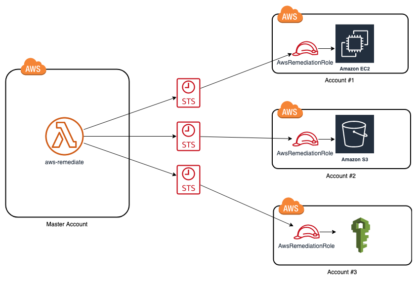

# AWS Remediations

[](https://circleci.com/gh/panther-labs/aws-remediations)

Open source AWS Lambda application to instantly remediate common security issues in your accounts.
The Lambda is running in a single account but it is able to remediate issues in other accounts by assuming an IAM
role in those accounts as it can be seen in the architecture diagram below:




## Building

The project requires Python 3.7+. 
To build the project locally run the following command:

```
make setup install
```

The above command will setup Python virtual env and install the appropriate dependencies. 

## Deployment

### Deploying the project from source code
We recommend using the [AWS SAM CLI](https://docs.aws.amazon.com/serverless-application-model/latest/developerguide/serverless-sam-reference.html#serverless-sam-cli) to deploy the application in your account.
1.  Install the AWS CLI, Docker and SAM CLI using the following [instructions](https://docs.aws.amazon.com/serverless-application-model/latest/developerguide/serverless-sam-cli-install.html).

1. Build the project: \
```make setup install```

1. Deploy the project in your account. You need to specify an S3 bucket in your account, where the source code
 will be uploaded prior to deploying: \
```make deploy-master bucket=<your-bucket>```

### Deploying the project from Serverless Application Repository

AWS Remediations are available from AWS Serverless Application Repository (SAR). 
You can navigate to SAR service through AWS Console, select 'aws-remediations' app from Panther Labs 
and deploy it in your account. 

### Deploying in multi-account setup

In case of a multi-account setup, you need to deploy the AWS Lambda in only one -master- account. In the other accounts, you need
to deploy just the IAM role that the Lambda will assume to remediate issues. You can do the following steps:

1. Deploy the Lambda in your master account following the [above steps](#deploying-the-project-from-source-code)

1. For the rest of the accounts run \
```make deploy-satellite bucket=<your-bucket> masterAccountId=<master-account-id>``` \
,where `master-account-id` is the Account Id of the account where the Lambda is deployed. 
## Usage
You can trigger a remediation by invoking the `aws-remediate` Lambda. 
The AWS Lambda input looks like the following
```
{
  "action": "remediate",
  "payload": {
    "remediationId": "AWS.S3.EnableBucketLogging",
    "resource": {
        "Name": "my-bucket",
        "AccountId": "123456789012",
        "Region": "us-west-2"
    },
    "parameters": {
      "TargetBucket": "my-bucket",
      "TargetPrefix": "my-prefix"
    }
  }
}
```


Field | Description
--- | --- 
*action* | The action to be performed by the application. It should always be set to `remediate` 
*payload.remediationId* | The unique identifier of the remediation that you want to trigger 
*payload.resource* | A JSON describing the resource you want to remediate. It needs to have `Region` and `AccountId` fields
*payload.parameters* | A JSON with the additional parameters needed for the remediation 

You can invoke the Lambda using AWS CLI. The following command enables log file validation for an existing CloudTrail trail.
```bash
aws lambda invoke --function-name aws-remediation \
--payload '{"action":"remediate","payload":{"remediationId":"AWS.CloudTrail.EnableLogValidation","resource":{"AccountId":"123456789012","Region":"us-west-2","Name":"test-bucket"},"parameters":{}}' \
 output.log
```

### Using AWS Systems Manager (AWS SSM)
The CloudFormation template creates additionally a [SSM Automation Document](https://docs.aws.amazon.com/systems-manager/latest/userguide/automation-documents.html) that can be used to remediate resources using AWS SSM. 


## Remediations
The list of available remediations can be seen in the [project directory](src/remediations).

